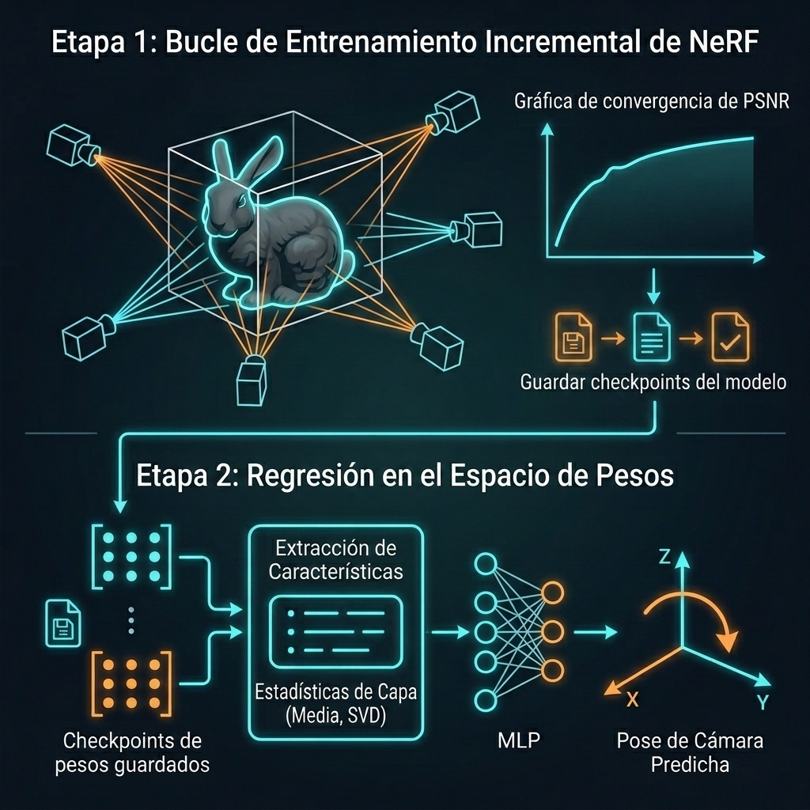

# Proyecto de Análisis Temporal de Pesos en NeRFs (Integración Nerfstudio)

Este documento define el plan arquitectónico y los pasos para desarrollar un sistema que permita rastrear, almacenar y analizar la evolución de los pesos de un modelo de NeRF usando **Nerfstudio**, aplicando una lógica de entrenamiento incremental condicional basado en la convergencia del entrenamiento (PSNR).

---

## Esquema del Proceso (Graphical Abstract)

---

## ETAPA 1: Registro Temporal e Incremental de NeRF

### Decisiones de Arquitectura

1. **Modelo de Reconstrucción (Nerfstudio):**
   - Usaremos **Nerfacto** como modelo base.
   - *Razón:* Combina rejillas hash con redes neuronales (MLP) densas de forma eficiente, permitiéndonos realizar un análisis de pesos reales sobre las capas MLP.
2. **Estrategia de Entrenamiento Incremental (Vía de Convergencia):**
   - Entrenamos el NeRF con el dataset activo actual $D_t$.
   - Evaluamos el PSNR promedio sobre todas las vistas activas de entrenamiento en $D_t$. Cuando este promedio supera un umbral establecido (ej. > 28 dB, indicando convergencia y representación satisfactoria del conjunto actual):
     1. Guardamos una copia temporal de los pesos del modelo en `pesos_historico/model_t_{iter}.ckpt`.
     2. Obtenemos la pose de la **Next Best View (NBV)** del método externo del usuario.
     3. Agregamos la imagen correspondiente a esa pose al dataset de entrenamiento activo ($D_{t+1}$).
     4. Reanudamos el entrenamiento con el nuevo dataset cargando el último checkpoint (`--load-dir`).
   - Al finalizar todo el proceso incremental, evaluamos el modelo final en un conjunto de pruebas/vistas no disponibles (validation/test set) para medir su capacidad de generalización.

3. **Interfaz con el Método Externo de NBV:**
   - **Formato del Ground Truth:** Definiremos un archivo de intercambio simple (ej. `next_nbv.json`) donde el método externo del usuario escribirá la pose de la cámara elegida (traslación y rotación), o bien una interfaz de lista predefinida.
   - **Representación de la Pose para Regresión:** Para la orientación de la cámara (rotación en 3D), usaremos la **representación continua en 6D propuesta por Zhou et al. (CVPR 2019)** para evitar las discontinuidades en el espacio $SO(3)$:
     - **Traslación:** Un vector en $\mathbb{R}^3$ representando la posición $[x, y, z]$.
     - **Rotación:** Un vector en $\mathbb{R}^6$ que representa las primeras dos columnas de una matriz de rotación. El modelo aplicará el proceso de ortogonalización de Gram-Schmidt para construir la matriz final de rotación $R \in SO(3)$ de forma continua y diferenciable.

### Métricas de Validación y Aprendizaje Incremental

Para evaluar la calidad de reconstrucción en las vistas no disponibles y la dinámica de aprendizaje continuo, consideraremos las siguientes métricas:

- **PSNR (Peak Signal-to-Noise Ratio):** Reconstrucción a nivel de píxeles (promedio de vistas).
- **SSIM (Structural Similarity Index):** Conservación de estructuras y contraste.
- **LPIPS (Learned Perceptual Image Patch Similarity):** Distancia perceptual utilizando redes profundas.
- **Olvido Catastrófico (Catastrophic Forgetting):** Caída del PSNR en las primeras vistas conforme se aprende de nuevas vistas.
- **Transferencia Positiva (Forward Transfer):** PSNR inicial de imágenes nuevas antes de agregarlas al entrenamiento.
- **Divergencia de Pesos (Weight Drift):** Distancia euclidiana y similitud del coseno entre pesos de iteraciones consecutivas.

---

## ETAPA 2: Meta-Análisis en el Espacio de Pesos (Weight Space Learning)

El objetivo de esta etapa es desarrollar una **red neuronal secundaria (Meta-Modelo)** que tome como entrada los pesos del NeRF (o su trayectoria temporal) y realice inferencias sobre el estado de aprendizaje o sobre el conjunto de datos integrado.

### 1. Tareas de Inferencia Propuestas para el Meta-Modelo (Foco en NBV)
El Meta-Modelo resolverá una tarea de regresión para estimar la siguiente mejor pose de cámara:
*   **Tarea Principal: Regresión hacia el Next Best View (NBV):**
    - **Entrada:** Los pesos $W_t$ (o sus estadísticas asociadas) del NeRF actual en el tiempo $t$.
    - **Salida:** Una pose estimada de cámara $\hat{\mathbf{p}}_{\text{NBV}} \in \mathbb{R}^3$ (representada en coordenadas esféricas: [radio $r$, elevación $\theta$, azimut $\phi$] o coordenadas cartesianas de pose).
    - **Definición de Ground Truth (NBV):** Proporcionada externamente (por el método ya desarrollado por el usuario). El controlador leerá la pose seleccionada para etiquetar el dataset de pesos correspondiente en cada paso de entrenamiento.
    - **Objetivo:** Que el Meta-Modelo aprenda a mapear la configuración de los pesos de la red a la ubicación espacial donde el modelo tiene mayor incertidumbre/peor rendimiento (la pose del NBV).
*   **Tarea Secundaria: Predicción del PSNR Promedio (Calidad de Reconstrucción):**
    - Red secundaria que predice el PSNR general del modelo actual, sirviendo como métrica de autoevaluación del progreso de aprendizaje.

### 2. Comparación de Métodos de Análisis en el Espacio de Pesos

| Método | Entrada Típica | Simetría de Permutación | Complejidad de Implementación | Pros y Contras |
| :--- | :--- | :--- | :--- | :--- |
| **MLP sobre Pesos Aplanados (Baseline)** | Vector plano de todos los parámetros $\theta \in \mathbb{R}^D$. | No respetada. Si permutamos los nodos de la red oculta, el clasificador falla. | **Muy baja** | 🟢 Fácil de implementar y entrenar. 🔴 Altamente propenso a sobreajuste por alta dimensionalidad, y sensible a reinicializaciones. |
| **Modelos de Estadísticas de Capas (Feature Engineering)** | Estadísticas por capa: media, varianza, valores singulares (SVD), normas y sparsity. | Totalmente respetada (las estadísticas son invariantes a la ordenación de neuronas). | **Baja** | 🟢 Extremadamente ligero, robusto a permutaciones y rápido de entrenar. 🔴 Pierde detalles estructurales finos del mapeo espacial. |
| **Deep Weight Space Networks (DWSNets / NFNs)** | Tensores estructurados de pesos de la red de origen. | Respetada mediante operaciones de permutación equivariante (capas DWS). | **Alta** (requiere capas de arquitectura matemática especializada). | 🟢 Estado del arte en el aprendizaje en espacio de pesos para representaciones implícitas (INRs/NeRFs). 🔴 Complejo de programar y requiere que todas las raíces compartan la misma arquitectura. |
| **Modelos Temporales (LSTM / Transformers)** | Secuencia temporal de estadísticas de peso o diferencias $\Delta W_t$. | Respetada si se alimenta de estadísticas invariantas. | **Media** | 🟢 Analiza la dinámica de aprendizaje (el camino recorrido en el entrenamiento) y no solo un estado estático. 🔴 Mayor costo computacional. |

### 3. Propuesta de Implementación para Etapa 2
Para avanzar con pasos firmes, iniciaremos con una estrategia **híbrida de Estadísticas de Capa + MLP**:
1. **Generación de Dataset:** En la Etapa 1, guardaremos un registro estructurado (`historico_dataset.json`) que mapee cada checkpoint `.ckpt` con su correspondiente PSNR promedio de entrenamiento, el PSNR de las vistas no entrenadas, y la pose real de la Next Best View ($\mathbf{p}_{\text{NBV}}$).
2. **Extractor de Características:** Crearemos un script `src/analysis/extract_features.py` que cargará cada checkpoint, aislará las MLPs de Nerfacto, y extraerá estadísticas clave (Media, Varianza, sparsity, normas $L_1$/$L_2$ y los 5 principales valores singulares vía SVD para cada capa).
3. **Meta-Modelo de Regresión:** Entrenaremos una red MLP secundaria en PyTorch que reciba las estadísticas del peso como entrada y devuelva la traslación predicha $\hat{\mathbf{t}} \in \mathbb{R}^3$ y la rotación en formato continuo 6D $\hat{\mathbf{r}} \in \mathbb{R}^6$. Reconstruiremos la matriz de rotación predicha $\hat{R} \in SO(3)$ usando Gram-Schmidt. 
   - **Función de Pérdida:** Para el entrenamiento, utilizaremos una pérdida compuesta por la distancia de traslación (MSE) y la distancia angular real (Pérdida Geodésica en $SO(3)$):
     $$\mathcal{L} = \text{MSE}(\hat{\mathbf{t}}, \mathbf{t}_{\text{gt}}) + \lambda \, \arccos\left(\frac{\text{Trace}(\hat{R}^T R_{\text{gt}}) - 1}{2}\right)$$
     Donde $\lambda$ es un factor de escala para balancear ambas pérdidas.

---

## Fases del Desarrollo Completo

### Fase 1: Configuración y Determinismo (Etapa 1)
- Estructurar carpetas e implementar pruebas de reproducibilidad de Nerfstudio (`tests/test_reproducibilidad.py`).

### Fase 2: Controlador Incremental (Etapa 1)
- Crear el script `run_incremental.py` para la actualización de `transforms_active.json` y el bucle automatizado de `ns-train` basado en el PSNR promedio.

### Fase 3: Análisis Tradicional e Histórico de Pesos (Etapa 1)
- Desarrollar `src/analysis/analyze_weights.py` para extraer distancias L2, similitud del coseno y generar proyecciones PCA de la evolución del entrenamiento.

### Fase 4: Extractor y Preparación de Datos de Pesos (Etapa 2)
- Desarrollar `src/analysis/extract_features.py` para procesar los checkpoints a variables estadísticas estables y resistentes a permutación.

### Fase 5: Entrenamiento del Meta-Modelo (Etapa 2)
- Desarrollar `src/meta_model/train_meta.py` para entrenar la red secundaria que inferirá el rendimiento (PSNR) o la fase de aprendizaje a partir de las estadísticas de los pesos.

### Fase 6: Visualización Integrada y Validación
- Crear gráficos comparativos entre las inferencias de la red secundaria y los valores reales calculados mediante renderizado tradicional.

---

## Plan de Verificación

### Pruebas Automatizadas
- Test de reproducibilidad de Nerfstudio para garantizar checkpoints consistentes.
- Test unitario del extractor de características: Verificar que permutar las neuronas de una capa del NeRF no afecte el vector de características estadísticas extraído para la red secundaria.

### Verificación Manual
- Entrenar un NeRF incrementalmente con una escena de juguete. Entrenar el Meta-Modelo con un 80% de los checkpoints y validar que prediga con precisión el PSNR de validación en el 20% de checkpoints no vistos.
